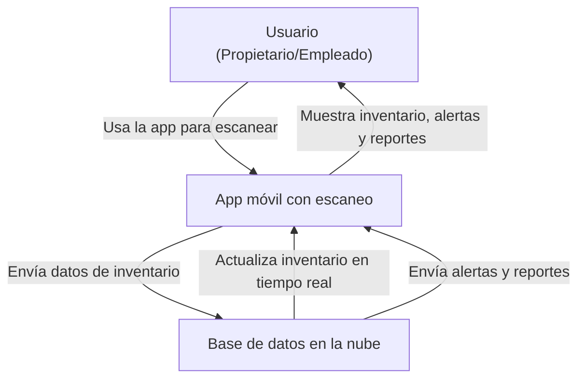

# Especificacion de requerimientos de software

**Proyecto: Desarrollo de una plataforma para el control de inventario**

## Ficha del documento ##

|  Fecha |Version  | Autor  | Verificado  | Observaciones  |
|---|---|---|---|---|
|   |   |   |   |   |
|   |   |   |   |   |
|   |   |   |   |   |

## Contenido ##

### Introducción ###

TODO: Redactar un parrafo donde se de una introducción al contenido de este documento 

### 1.1 Propósito

En ete documento se define las especificaciones y no funcionales de la plataforma para el control de inventario. Este sera utilizado como guia para clientes y desarrolladores

### 1.2 Alcance ###

TODO: Redactar

### 1.3 Personal Involucrado ###

| Nombre                  | Carol Gonzalez                                            |
|-------------------------|-----------------------------------------------------------|
| Rol                     | Desarrollador Backend                                     |
| Categoria Profesional   | Estudiante de Ingenieria en Sistemas                      |
| Responsabilidad         | Diseñar,desarrollar e implementar el backend del sistema  |
| Información de contacto | cdalugonzalez@ucompensar.edu.co                           |

### 1.4 Definiciones, acronimos y abreviaturas ###

| Nombre  | Descripción                                          |
|---------|------------------------------------------------------|
| Usuario | Persona que usará el sistema para gestionar procesos |
| ERS     | Especificación de Requisitos Software                |
| RF      | Requerimiento Funcional                              |
| RNF     | Requerimiento No Funcional                           |
 
### 1.5 Referencias 

### 1.6 Resumen ###

## 2 Descripcion General ##

### 2.1 Perspectiva del producto ###

