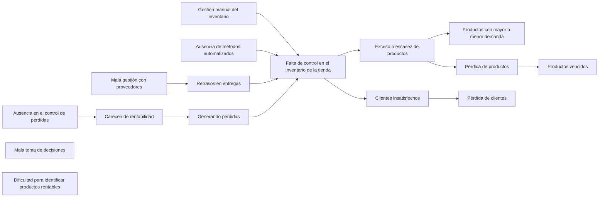

**Carol Gonzalez**

## Contexto Problema ##

Mi tia tiene dificultades para controlar el inventario de su tienda. No sabe con 
exactitud que productos tiene en su existencia, cuales se venden más rápido o 
cuales están generando perdidas. Esto le impide tomar decisiones acerca de que 
productos compra, como fijar los precios y como promocionar la tienda. 

## Arbol de Problemas ##

## Prompt ##

Quiero crear una idea de negocio que sea rentable, escalable y con potencial de crecimiento digital. Estoy interesado/a en el mal manejo de inventario de una tienda de barrio. Sugiere 3 ideas innovadoras que incluyan el uso de tecnología (como apps, plataformas web o soluciones digitales). Me gustaría que fueran accesibles con bajo presupuesto inicial y que puedan crecer progresivamente. Incluye una breve descripción de cada idea, el público objetivo y el problema que resuelve

## Soluciones Tecnologicas ##

Idea 1: App móvil con escaneo de código y control en tiempo real

Descripción
Una aplicación móvil ligera que permite escanear códigos de barras o QR para registrar entradas (compra) y salidas (venta) de productos. La app se conecta a una pequeña base de datos en la nube o servidor compartido, mostrando inventario en tiempo real, alertas de escasez y reportes básicos.

Público objetivo
Pequeñas tiendas de barrio, minimercados o negocios familiares con poca o ninguna solución digital.

Problema que resuelve
Evita errores de conteo manual y pérdidas por falta o exceso de stock. Mejora la transparencia y velocidad en la actualización del inventario.

Algunas plataformas ya ofrecen funcionalidades similares de forma accesible. Por ejemplo, el uso de smartphones en lugar de hardware costoso demuestra que el enfoque es viable para pequeños negocios 

Idea 2: Plataforma web progresiva (PWA) con escaneado y almacenamiento offline

Descripción
Una Progressive Web App (PWA) que funciona en navegadores móviles y de escritorio, con capacidad para trabajar incluso sin conexión. Permite registrar inventario vía escaneo y sincroniza automáticamente cuando hay internet. Incluye dashboard web para gestión de stock, alertas y reportes simples.

Público objetivo
Negocios móviles, ferias o tiendas con conexión intermitente que necesitan control digital pero sin depender de apps nativas.

Problema que resuelve
Permite registrar ventas e inventario en tiempo real sin necesidad de conexión constante, clave para tiendas en zonas con señal débil. Usar PWA reduce costos de desarrollo y es escalable 

Idea 3: Sistema con etiquetas QR + análisis básico en la nube

Descripción
Implementar un sistema de etiquetado de productos con QR o códigos que enlazan a una web o plataforma ligera. Al escanear las etiquetas, se tiene acceso a ficha del producto e historial de movimientos. El sistema permite alertas automáticas para bajas frecuentes o productos lentos.

Público objetivo
Tiendas con diversidad de productos (alimentación, ropa, abarrotes) que buscan orden sin complicarse.

Problema que resuelve
Facilita identificación precisa y rápida, reduce errores y permite identificar productos de alta rotación o poca venta. Es una solución flexible y escalable basada en tecnología estándar

## Idea seleccionada ##

Idea 1: App móvil con escaneo de código y control en tiempo real

Descripción
Una aplicación móvil ligera que permite escanear códigos de barras o QR para registrar entradas (compra) y salidas (venta) de productos. La app se conecta a una pequeña base de datos en la nube o servidor compartido, mostrando inventario en tiempo real, alertas de escasez y reportes básicos.

Público objetivo
Pequeñas tiendas de barrio, minimercados o negocios familiares con poca o ninguna solución digital.

Problema que resuelve
Evita errores de conteo manual y pérdidas por falta o exceso de stock. Mejora la transparencia y velocidad en la actualización del inventario.

Algunas plataformas ya ofrecen funcionalidades similares de forma accesible. Por ejemplo, el uso de smartphones en lugar de hardware costoso demuestra que el enfoque es viable para pequeños negocios

## Justificacion ##

Considero que es facil de manejar para todo tipo de personas, en este caso mi tia, que no es tan experta con las nuevas tecnologias seria mucho mas facil para ella aparte de la creatividad de esta idea, la verdad no la he visto en ningun negocio y mucho menos en uno de barrio.

    
