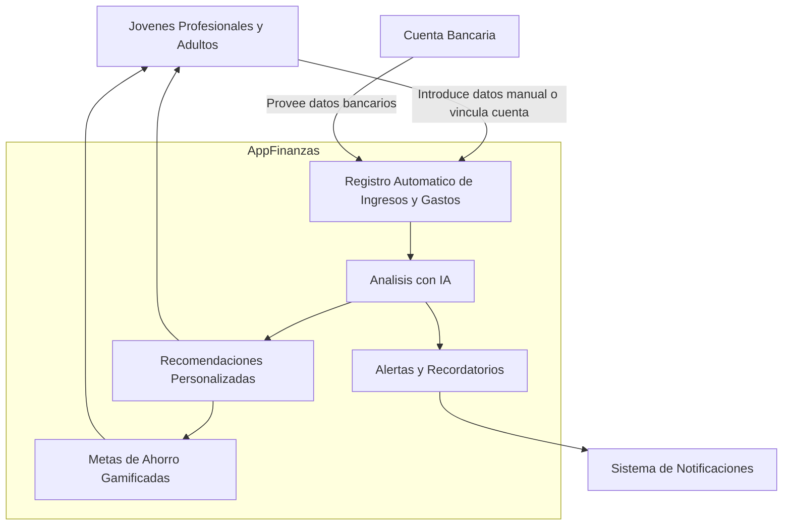

# Especificaciones de requisitos de software

**Proyecto: Desarrollo de una plataforma que ayude a mejorar los habitos de consumo y ahorro del dinero**

## Ficha del Documento

| Fecha  | Versión  |Autor   |Verificado   |Observaciones   |
|---|---|---|---|---|
|   |   |   |   |   |

## Contenido

## 1 Introduccion

TODO: Redactar un parrafo donde se de una introduccionde este documento

### 1.1 Propósito

En este documento se define las especificaciones funcionales y no funcionales de la plataforma de gestion del dinero sobre habitos de consumo y consejos de ahorro para cumplir las metas propuestas. Este sera utilizado como guia para los clientes y los desarrolladores.

### 1.2 Alcance

TODO: Redactar 

### 1.3 Personal Involucrado

| Nombre                  | Carlos Bonilla                                            |
|-------------------------|-----------------------------------------------------------|
| Rol                     | Desarrollador Backend                                     |
| Categoria Profesional   | Estudiante de Ingenieria de Sistemas                      |
| Responsabilidad         | Diseñar, desarrollar e implementar el backend del sistema |
| Información de contacto | cibonilla@ucompensar.edu.co                               |

### 1.4 Definiciones, acronimos y abreviaturas

| Nombre  | Descripción                                          |
|---------|------------------------------------------------------|
| Usuario | Persona que usará el sistema para gestionar procesos |
| ERS     | Especificación de Requisitos Software                |
| RF      | Requerimiento Funcional                              |
| RNF     | Requerimiento No Funcional                           |

### 1.5 Referencias

### 1.6 Resumen

## 2 Descripción general

### 2.1 Perspectiva del producto

#### Diagrama de contexto

