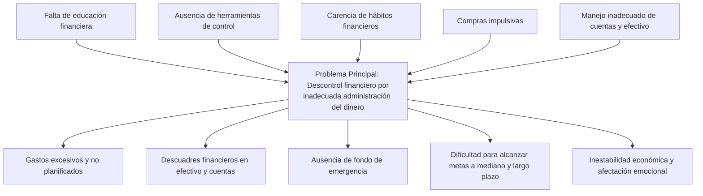

**Carlos Ivan Bonilla Beltran**

## Contexto Problematica

Una persona con ingresos regulares presenta un descontrol financiero debido a una inadecuada administración de su dinero. La falta de herramientas y hábitos de control genera gastos no planificados, compras impulsivas y descuadres en el manejo de efectivo y cuentas bancarias. Esta situación le impide ahorrar, planificar objetivos a mediano y largo plazo, y mantener estabilidad económica.

## Arbol de Problemas

## Prompt

"Quiero crear una idea de negocio que sea rentable, escalable y con potencial de crecimiento digital. Estoy interesado/a en el descontrol financiero por inadecuada administración del dinero. Sugiere 3 ideas innovadoras que incluyan el uso de tecnología (como apps, plataformas web o soluciones digitales). Me gustaría que fueran accesibles con bajo presupuesto inicial y que puedan crecer progresivamente. Incluye una breve descripción de cada idea, el público objetivo y el problema que resuelve."

## Soluciones Tecnologicas

### 1. App de Finanzas Personales con Inteligencia Artificial

Descripción:
Una aplicación móvil que registre ingresos y gastos de forma automática (vinculada a cuentas bancarias o con carga manual simple) y que, mediante IA, brinde recomendaciones personalizadas: alertas de sobre-gasto, recordatorios de pagos, metas de ahorro gamificadas.

Público objetivo:
Jóvenes profesionales y adultos con ingresos regulares que no tienen hábitos de control financiero.

Problema que resuelve:
La falta de herramientas prácticas para llevar un presupuesto y la dificultad para mantener hábitos financieros saludables.

### 2. Plataforma Web de Educación Financiera Interactiva

Descripción:
Un portal con cursos cortos, simuladores y retos gamificados (ej: “ahorra $100.000 en 30 días”), que enseñe conceptos básicos de administración del dinero, inversión y ahorro. Se puede monetizar con suscripciones bajas, publicidad o alianzas con bancos/fintech.

Público objetivo:
Estudiantes universitarios, emprendedores y trabajadores que buscan aprender a manejar mejor su dinero sin pagar cursos costosos.

Problema que resuelve:
La falta de educación financiera accesible y atractiva, que explique de manera sencilla cómo organizar ingresos, controlar gastos y planificar objetivos.

### 3. Asistente Virtual de Finanzas (Chatbot Multicanal)

Descripción:
Un chatbot que funcione en WhatsApp, Telegram y web, donde el usuario pueda consultar su saldo estimado, recibir consejos de ahorro, calcular gastos mensuales y generar reportes automáticos. Inicialmente básico, luego puede integrar IA para personalizar recomendaciones.

Público objetivo:
Personas que no usan apps complejas pero sí están conectadas a mensajería instantánea.

Problema que resuelve:
La dificultad de muchas personas para organizar sus finanzas debido a la falta de disciplina y la resistencia a usar herramientas sofisticadas.

## Idea Seleccionada

### 1. App de Finanzas Personales con Inteligencia Artificial

Descripción:
Una aplicación móvil que registre ingresos y gastos de forma automática (vinculada a cuentas bancarias o con carga manual simple) y que, mediante IA, brinde recomendaciones personalizadas: alertas de sobre-gasto, recordatorios de pagos, metas de ahorro gamificadas.

Público objetivo:
Jóvenes profesionales y adultos con ingresos regulares que no tienen hábitos de control financiero.

Problema que resuelve:
La falta de herramientas prácticas para llevar un presupuesto y la dificultad para mantener hábitos financieros saludables.

### Explicacion:
Elegi esta opción por que me parece que es mas factible crear una aplicación flexible para la mayor cantidad de usuarios posible ya que el tener problemas en el control de los gastos es algo relativamente comun.
