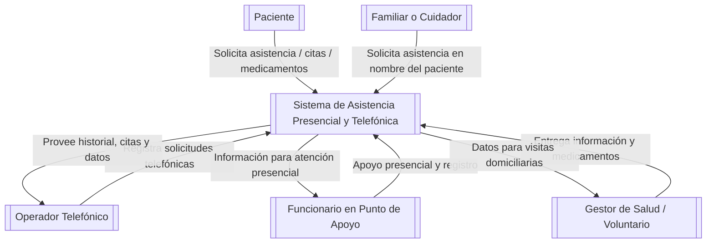

# Especificacion de requerimientos de sofware 

**Proyecto: Plataformapara la gamificación a travez  del uso de rutas alternativas para la ciudad de Bogotá**

# Ficha del documento
| Fecha|Versión| Autor| Verificacion| Observaciones  |
|----  |---    |---  |---          |---             |
|       |       |     |             |               |

## Contenido

##  1 Introducción

TODO :Redactar un parrafo donde se de un aintrodución al contenido de este documento

### 1.1 Propósito

En este documento se define las indicaciones funcionales y no funcionales de la plataforma de gamaficación sobre el y uso de rutas alternativas para la ciudad de Bogotá . Este sera utilizado como guia para clientes y desarrolladores.

### 1.2 Alcance
TODO :redactar despues 

### 1.3 PERSONAL Involucrado

| Nombre                   | Jhon Casas                                                                               |  
|--------------------------|------------------------------------------------------------------------------------------|
| ROL                      | Desarrollador                                                                            |  
| Categoría profesional    | Estudiante de ingeniería de sistemas                                                     |    
| Responsabilidad          | Diseñador, desarrollador e implementar el backend del sistema, incluido la base de datos |     
| Imformcacion de contacto | jhonacasas@ucompensar.edu.co                                                             |    

### 1.4 Definiciones,acrónimos y abreviaturas

| Nombre  | Descripción                                          |
|---------|------------------------------------------------------|
| Usuario | Persona que usará el sistema para gestionar procesos |
| ERS     | Especificación de Requisitos Software                |
| RF      | Requerimiento Funcional                              |
| RNF     | Requerimiento No Funcional                           |

### 1.5 Referencias

### 1.6 Resumen 

## 2 Descripción general 

### 2.1 Perspectiva del producto

