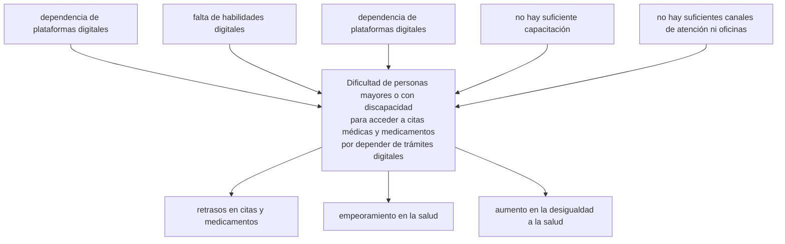

**Jhon Alexander Casas Chillon**

# Contexto problematica 

* la problematica es la siguiente: hay una abuelita y una tía la cual tiene un problema en congénito en donde es muy difícil poderles solicitarles una cita o poder encontrar los lugares en donde les entreguen sus medicamentos en el cual a continuacion tenemos nustro arbl de problemas 

# Árbol de problemas 

* Este es el codigo de mi arbol de problemas en donde encontraremos las prablematicas y las causas , con la ayuda de la ia  

 

# Plantiamento de problematica
Encontramos el plantiamiento en donde ponemos que una idea de negocio la cual tenga el potencial de crecimiento
y en donde me suguiriera 3 ideas

Quiero crear una idea de negocio que sea rentable, escalable y con potencial de crecimiento digital. Estoy interesado/a en hay una abuelita y una tía la cual tiene un problema en congénito en donde es muy difícil poderles solicitarles una cita o poder encontrar los lugares en donde les entreguen sus medicamentos. Sugiere 3 ideas innovadoras que incluyan el uso de tecnología (como apps, plataformas web o soluciones digitales). Me gustaría que fueran accesibles con bajo presupuesto inicial y que puedan crecer progresivamente. Incluye una breve descripción de cada idea, el público objetivo y el problema que resuelve.

* en este punto tomamos la problematica que mencionamos anteriror mente en donde
con la ayuda de la ia ,le pedimos que nos diera 3 ideas de negocios las cuales fueran 
rentables  y que nosotros como ingenieros podamos inplementar  y de las 3 elejimos la que mas 
nos llama la atencion a la cual se tomo y con ia le pedimos que nos creara un codigo html en donde nos 
trara como seria la primera parte de nustra app  prototipo .

# Soluciones tecnologicas 

* 1 Asistente virtual de salud para pacientes crónicos
 Idea: Un chatbot inteligente (IA) que:
Recuerde horarios de medicación.
Ayude a solicitar citas (con formularios automatizados).
Guíe a la familia sobre dónde encontrar medicamentos.
Genere reportes de adherencia para médicos.
Rentabilidad:
Suscripción mensual para familias que quieran un asistente digital.
Licenciamiento del sistema a EPS o aseguradoras.
 Implementación inicial:
Integración con WhatsApp Business API para llegar fácil al usuario.
Motor de IA con GPT + base de datos médica.
Panel web para familiares/médicos con reportes.

* 2 Plataforma de gestión de citas médicas con geolocalización de farmacias
 Idea: Una aplicación web/móvil que permita:
Agendar citas médicas en línea (integrada con EPS/IPS o médicos independientes).
Notificar recordatorios automáticos.
Usar geolocalización para mostrar farmacias cercanas con disponibilidad de medicamentos.
 Rentabilidad:
Modelo de suscripción para clínicas y consultorios pequeños que quieran digitalizar sus agendas.
Publicidad o convenios con farmacias para que aparezcan destacadas.
 Implementación inicial:
Frontend en React o Flutter (para web y móvil).
Backend en Java + Spring Boot o Node.js.
API de mapas (Google Maps o Mapbox).

* 3 Asistente virtual de salud para pacientes crónicos
 Idea: Un chatbot inteligente (IA) que:
Recuerde horarios de medicación.
Ayude a solicitar citas (con formularios automatizados).
Guíe a la familia sobre dónde encontrar medicamentos.
Genere reportes de adherencia para médicos.
 Rentabilidad:
Suscripción mensual para familias que quieran un asistente digital.
Licenciamiento del sistema a EPS o aseguradoras.
Posible modelo freemium (funciones básicas gratis y premium con reportes avanzados).
 Implementación inicial:
Integración con WhatsApp Business API para llegar fácil al usuario.
Motor de IA con GPT + base de datos médica propia.
Panel web para familiares y médicos con reportes de adherencia y recordatorios.

# Idea selecionada 
la idea selecionada fue la tercera de las 3 que con la ayuda de la ia nos dio  en la cual tenemos la siguiente propuesta :

-	Programa de Asistencia Presencial y Telefónica para Citas y Medicamentos
-	Descripción:
Un sistema de apoyo que no dependa únicamente de aplicaciones o internet, sino que incluya atención presencial y telefónica, con personal capacitado para ayudar a personas que no pueden o no saben manejar herramientas digitales.
	________________________________________
-	Cómo funcionaría:
-	Línea Telefónica de Atención Humana
-	Número gratuito disponible 24/7, donde operadores registren las solicitudes de citas médicas o la ubicación de farmacias que entregan medicamentos.
-	Operadores entrenados para hablar claro, repetir información y confirmar que la persona entendió.
-	Posibilidad de que un familiar o cuidador llame en nombre de la persona.
-	Puntos de Apoyo en la Comunidad
-	Funcionarios en centros de salud, alcaldías locales, y bibliotecas públicas que ayuden a:
-	Solicitar citas.
-	Ubicar farmacias o centros de entrega de medicamentos.
-	Tramitar autorizaciones.
-	Atención prioritaria para personas mayores o con discapacidad.
-	Acompañamiento por Voluntarios o Gestores de Salud
-	Red de voluntarios o trabajadores comunitarios que puedan ir a la casa si la persona no puede desplazarse.
-	Estos gestores llevan la información impresa o incluso los medicamentos en casos autorizados.
-	Sistema de Registro Interno
-	Aunque la persona no use tecnología, el sistema centralizado guarda sus datos, historial de citas y entregas para que el operador o funcionario siempre tenga la información actualizada.
	________________________________________
-	Beneficios:
-	La persona no necesita saber usar un celular o internet.
-	Atención humana y personalizada.
-	Reduce el estrés y la frustración de intentar hacer trámites digitales.
-	Mayor cobertura para adultos mayores y personas con discapacidad.

* Esta propuesta nos dice que es un programa de atencion para personas mayores y personas con discapacidad ,en donde se puede encontrar con de manera mucho mas facil 
y en donde el servicio se encuentre activo 24/7  dando la facilidad a las personas de poder solicitar sus citas , medicamentos , diferentes cervicios 
que se necesiten ya que no es muy comun con tar con un servicio especializado para esta poblacion y en a cual le permita a 
las personas saber donde encontrar sus medicamentos o los lugares en los cuales les puedan prestar el servicio espacializado que necesitan y al final tenemos el codigo de nuestro prototipo en html
          
 

